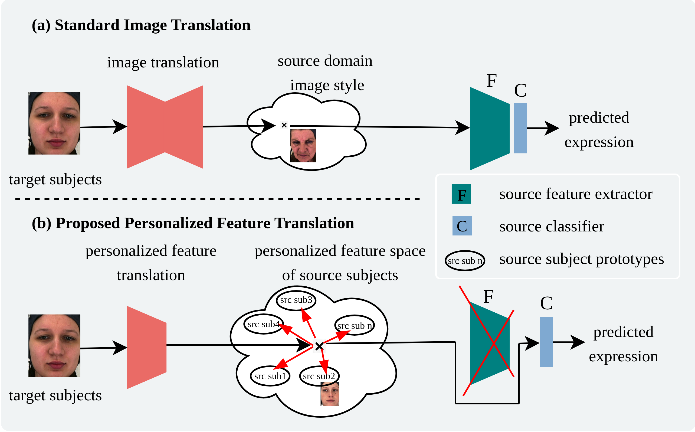
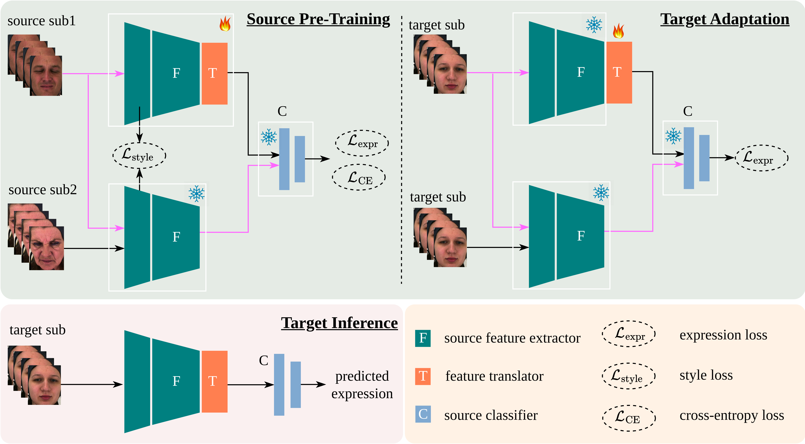

# [Personalized Feature Translation for Expression Recognition: An Efficient Source-Free Domain Adaptation Method (ICLR2026)](https://arxiv.org/pdf/2508.09202)

by
**Masoumeh Sharafi<sup>1</sup>,
Soufiane Belharbi<sup>1</sup>,
Muhammad Osama Zeeshan<sup>1</sup>,
Houssem Ben Salem<sup>1</sup>,
Ali Etemad<sup>5</sup>,
Alessandro Lameiras Koerich<sup>2</sup>,
Marco Pedersoli<sup>1</sup>,
Simon Bacon<sup>3,4</sup>,
Eric Granger<sup>1</sup>**

<sup>1</sup> LIVIA, LLS, Dept. of Systems Engineering, ÉTS, Montreal, Canada
<br/>
<sup>2</sup> LIVIA, Dept. of Software and IT Engineering, ÉTS, Montreal, Canada
<br/>
<sup>4</sup> Dept. of Health, Kinesiology \& Applied Physiology, Concordia University, Montreal, Canada
<br/>
<sup>5</sup> Montreal Behavioural Medicine Centre, Montreal, Canada
<br/>
<sup>3</sup> Dept. of Electrical and Computer Engineering, Queen’s University, Kingston, Canada


<p align="center">
<p align="center">

[](https://arxiv.org/pdf/2508.09202)

## Abstract
Facial expression recognition (FER) models are employed in many video-based affective computing applications, such as human-computer interaction and healthcare monitoring.  However, deep FER models often struggle with subtle expressions and high inter-subject variability, limiting their performance in real-world applications. To improve their performance, source-free domain adaptation (SFDA) methods have been proposed to personalize a pretrained source model using only unlabeled target domain data, thereby avoiding data privacy, storage, and transmission constraints. This paper addresses a challenging scenario, where source data is unavailable for adaptation, and only unlabeled target data consisting solely of neutral expressions is available. SFDA methods are not typically designed to adapt using target data from only a single class. Further, using models to generate facial images with non-neutral expressions can be unstable and computationally intensive. 
%
In this paper, personalized feature translation (PFT) is proposed for SFDA. Unlike current image translation methods for SFDA, our lightweight method operates in the latent space. We first pre-train the translator on the source domain data to transform the subject-specific style features from one source subject into another. Expression information is preserved by optimizing a combination of expression consistency and style-aware objectives. Then, the translator is adapted on neutral target data, without using source data or image synthesis. By translating in the latent space, PFT avoids the complexity and noise of face expression generation, producing discriminative embeddings optimized for classification. Using PFT eliminates the need for image synthesis, reduces computational overhead (using a lightweight translator), and only adapts part of the model, making the method efficient compared to image-based translation. Extensive experiments on four challenging video FER benchmark datasets, BioVid, StressID, BAH, and Aff-Wild2, show that PFT consistently outperforms state-of-the-art SFDA methods, providing a cost-effective approach that is suitable for real-world, privacy-sensitive FER applications. 


## Citation:
```sh
@inproceedings{sharafi26pers,
  title={Personalized Feature Translation for Expression Recognition: An Efficient Source-Free Domain Adaptation Method},
  author={Sharafi, M. and Belharbi, S. Zeeshan, M. O. and Ben Salem, H. and Etemad, A. and  Koerich, A.L. and Pedersoli, M. and Bacon, S. and Granger, E.},
  booktitle={ICLR},
  year={2026}
}
```


## Installation of the environments
```bash
torch>=2.0.0
torchvision>=0.15.0
torchaudio>=2.0.0
scikit-learn>=1.1.0
tensorboard>=2.10.0
argparse
opencv-python
dlib
scipy
tqdm
```


## Datasets
```sh
Biovid: https://www.nit.ovgu.de/BioVid.html#PubACII17
StressID: https://project.inria.fr/stressid/
BAH: https://www.crhscm.ca/redcap/surveys/?s=LDMDDJR3AT9P37JY
Aff-Wild2: https://sites.google.com/view/dimitrioskollias/databases/aff-wild2
```
## Dataset Structure & Pairing
The source training data should be organized into subject-specific folders. Each folder contains images with expression labels embedded in the filenames. The expression label (e.g., N for neutral, P for pain) appears at the end of each filename before the extension. Target images follow the same filename structure, but all samples are from a single subject, not across subjects.
```sh
source_sub1/
├── Image1_P.jpg
├── Image2_N.jpg
...

source_sub2/
├── Image1_N.jpg
├── Image2_P.jpg
...
```

## Train the model on source domain
```sh
python train_translator.py \
    --folder1 /path/to/source_sub1 \
    --folder2 /path/to/source_sub2 \
    --pretrained_F /path/to/source_F.pt \
    --pretrained_B /path/to/source_B.pt \
    --pretrained_C /path/to/source_C.pt \
    --epochs 100 \
    --batch_size 64 \
    --lr 1e-4 \
    --style_layers 0,1,2 \
    --log_dir ./runs/pft_train \
    --ckpt_dir ./checkpoints/pft_train
```

## Adaptation to target domains (subjects)
```sh
python train_translator.py \
    --folder1 /path/to/target_neutral \
    --folder2 /path/to/target_neutral \
    --pretrained_F /path/to/source_F.pt \
    --pretrained_B /path/to/source_B.pt \
    --pretrained_C /path/to/source_C.pt \
    --pretrained_T /path/to/source_C.pt 
    --epochs 25 \
    --batch_size 32 \
    --lr 1e-4 \
    --log_dir ./runs/pft_target \
    --ckpt_dir ./checkpoints/pft_target
```
## Test
```sh
python test_target.py \
    --test_root /path/to/target_labeled \
    --ckpt_dir /path/to/translator_checkpoints \
    --pretrained_B /path/to/source_B.pt \
    --pretrained_C /path/to/source_C.pt \
    --output_dir ./results/ \
    --subject_name SubjectX
```
